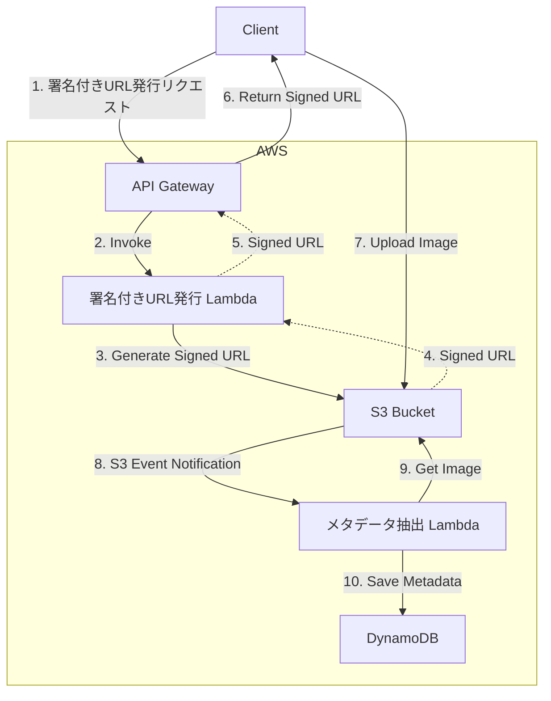
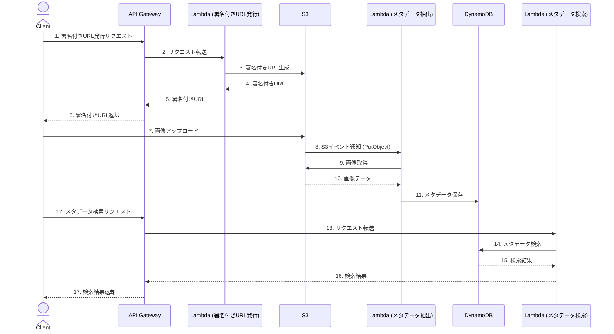

# アーキテクチャ設計書

## 1. 概要

本ドキュメントは、「AWS構築＆Go開発ハンズオン」で構築する画像アップロード＆メタデータ管理システムのアーキテクチャを定義する。
本システムは、クライアントが画像をアップロードし、その画像からExifメタデータを抽出し、データベースに保存・検索する機能を提供する。AWSのサーバーレスアーキテクチャを採用し、スケーラブルでメンテナンス性の高いシステムを目指す。

## 2. 機能要件

主要な機能は以下の通り。詳細は `requirements-document.md` を参照。

- **画像アップロード機能**:
    - クライアントはS3署名付きURLを取得し、画像をアップロードする。
    - 対象画像形式はJPEGおよびTIFF、最大ファイルサイズは10MB。
- **Exifメタデータ抽出機能**:
    - S3への画像アップロードをトリガーにLambdaが起動し、Exifメタデータを抽出する。
- **メタデータ永続化機能**:
    - 抽出したメタデータをDynamoDBに保存する。
    - 同じファイル名の画像がアップロードされた場合はメタデータを上書きする。
- **メタデータ検索機能**:
    - ImageID, FileName, UploadTimestamp（期間指定）でメタデータを検索するAPIを提供する。

## 3. 非機能要件

主要な非機能要件は以下の通り。詳細は `nonfunctional-requirements-document.md` を参照。

- **パフォーマンス**: 画像アップロードからメタデータ永続化までを10秒以内、API応答時間を3秒以内とする。
- **セキュリティ**: IAMロールは最小権限の原則に基づき設定し、S3バケットのパブリックアクセスはブロックする。
- **可用性**: AWSの各サービスのデフォルト可用性に準拠する。
- **運用・監視**: ログはCloudWatch Logsに集約し、メトリクスはCloudWatchで監視する。
- **スケーラビリティ**: Lambdaの同時実行数、DynamoDBのオンデマンドキャパシティにより自動的にスケールさせる。
- **コスト**: AWS無料枠の範囲内での運用を目指し、ハンズオン終了後はリソースを削除する。

## 4. アーキテクチャ

### 4.1. システム構成図

### 4.2. シーケンス図

本システムにおける主要な処理フローのシーケンス図を以下に示す。

## 5. データモデル

本システムで利用するDynamoDBのデータモデルを以下に定義する。

- **テーブル名**: `ImageMetadata`
- **プライマリキー**: `imageID` (String)
- **グローバルセカンダリインデックス (GSI)**:
    - `fileName-index`: パーティションキー `fileName`
    - `uploadTimestamp-index`: パーティションキー `uploadTimestamp`

| 属性名 | データ型 | 説明 |
|:---|:---|:---|
| `imageID` | String | 一意の画像ID (UUID) |
| `fileName` | String | S3オブジェクトキー |
| `fileSize` | Number | ファイルサイズ (bytes) |
| `uploadTimestamp` | String | アップロード日時 (ISO 8601) |
| `manufacturer` | String | カメラメーカー |
| `model` | String | カメラモデル |
| `dateTimeOriginal` | String | 撮影日時 (ISO 8601) |
| `exposureTime` | String | 露出時間 |
| `fNumber` | String | F値 |
| `isoSpeedRatings` | Number | ISO感度 |
| `focalLength` | String | 焦点距離 |
| `gpsLatitude` | Number | GPS緯度 |
| `gpsLongitude` | Number | GPS経度 |
| `gpsAltitude` | Number | GPS高度 |
| `orientation` | Number | 画像の向き |

## 6. コンポーネント仕様

各AWSコンポーネントの役割と責務を以下に定義する。

- **Amazon API Gateway**:
    - クライアントからのHTTPリクエストを受け付けるエンドポイント。
    - 署名付きURL発行Lambdaおよびメタデータ検索Lambdaを起動するトリガーとなる。
    - RESTful APIとしてインターフェースを公開する。
- **AWS Lambda (署名付きURL発行)**:
    - API Gatewayからのリクエストを受け、S3の署名付きURLを生成して返却する。
    - Go言語で実装される。
- **AWS Lambda (メタデータ抽出)**:
    - S3のPutObjectイベントをトリガーに起動する。
    - アップロードされた画像を取得し、Exifメタデータを抽出する。
    - 抽出したメタデータをDynamoDBに保存する。
    - Go言語で実装される。
- **AWS Lambda (メタデータ検索)**:
    - API Gatewayからのリクエストを受け、DynamoDBからメタデータを検索して返却する。
    - Go言語で実装される。
- **Amazon S3**:
    - アップロードされたオリジナル画像を格納するストレージ。
    - バケットはプライベートアクセスとし、署名付きURL経由でのみアップロードを許可する。
    - PutObjectイベントにより、メタデータ抽出Lambdaをトリガーする。
- **Amazon DynamoDB**:
    - 抽出したExifメタデータを永続化するNoSQLデータベース。
    - `ImageID`をプライマリキーとし、高速な読み書きを実現する。
    - GSIを利用して、ファイル名やアップロード日時での検索を可能にする。